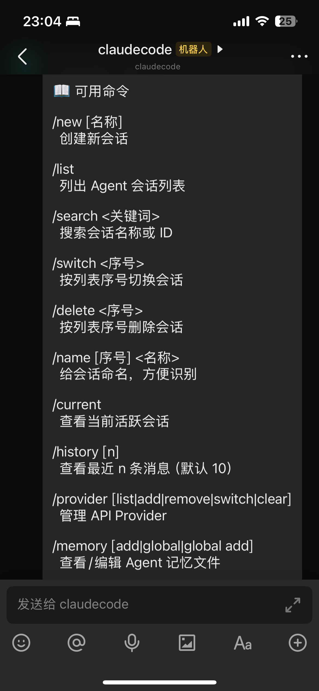

<p align="center">
  
</p>

<p align="center">
  <a href="https://github.com/ClaymanTwinkle/lark-agent-bot/releases"></a>
  <a href="https://www.npmjs.com/package/lark-agent-bot"></a>
  <a href="https://github.com/ClaymanTwinkle/lark-agent-bot/actions/workflows/ci.yml"></a>
  <a href="./LICENSE"></a>
</p>

<p align="center">
  English | <a href="./README.zh-CN.md">中文</a>
</p>

# lark-agent-bot

Drive the AI coding agent on your own machine from Feishu / Lark.

> Formerly `lark-connect`. Renamed to `lark-agent-bot` in v0.3.0; the command, npm package, config directory (`~/.lark-agent-bot`) and environment variables (`LARK_AGENT_BOT_*`) all changed with it.

lark-agent-bot bridges locally running Claude Code and Codex to a Feishu / Lark bot. It talks to Feishu over a WebSocket long connection, so **no public IP is needed**. Review code, fix bugs, research, or run scheduled jobs from your phone.

> Derived from [chenhg5/cc-connect](https://github.com/chenhg5/cc-connect) (MIT), trimmed down to the Feishu / Lark platform only. All other messaging platforms were removed, and only the Claude Code and Codex agents are kept.

<p align="center">
  
</p>

## Features

- **Two agents**: Claude Code and Codex
- **Native Feishu / Lark UX**: interactive cards, streaming replies, permission buttons, images / files / voice, one-scan bot creation
- **Chat as the control plane**: `/model`, `/mode`, `/new` `/list` `/switch`, `/dir`
- **Scheduled tasks**: `/cron add 0 9 * * * summarize yesterday's commits`, or ask the agent in plain language
- **Multi-project**: one process runs many projects, each with its own agent and Feishu bot
- **Web admin**: manage projects, providers, sessions and cron jobs in the browser
- **Self-update**: `lark-agent-bot update`, or `/upgrade` in chat

## Install

```bash
# Option 1: npm (any OS)
npm install -g lark-agent-bot

# Option 2: download the archive for your OS from Releases, extract it and put the
#           lark-agent-bot binary (lark-agent-bot.exe on Windows) on PATH
#   https://github.com/ClaymanTwinkle/lark-agent-bot/releases
#   e.g. lark-agent-bot-v0.1.0-linux-amd64.tar.gz, lark-agent-bot-v0.1.0-windows-amd64.zip

# Option 3: build from source (Go 1.25+; the web admin also needs Node.js 20+ and pnpm)
git clone https://github.com/ClaymanTwinkle/lark-agent-bot.git
cd lark-agent-bot
make build                          # builds the web admin, then ./lark-agent-bot
go build ./cmd/lark-agent-bot       # Go only: same binary without the web admin
```

You also need at least one agent CLI installed and logged in, for example:

```bash
npm install -g @anthropic-ai/claude-code   # Claude Code
npm install -g @openai/codex               # Codex
```

## Quick start

### 1. Create a Feishu bot (scan a QR code)

Run this in the repository the agent should work in:

```bash
cd /path/to/your/repo
lark-agent-bot feishu setup --project my-project
```

Scan the QR code with the Feishu app. The bot is created and its `app_id` / `app_secret` are written to `~/.lark-agent-bot/config.toml` (a missing project is created with the current directory as its work dir). A first project uses Claude Code if `claude` is installed, otherwise Codex if `codex` is; pass `--agent claudecode` or `--agent codex` to choose. To bind an existing app instead:

```bash
lark-agent-bot feishu bind --project my-project --app cli_xxx:app_secret_xxx
```

Or edit the config by hand. Minimal example:

```toml
[[projects]]
name = "my-project"

[projects.agent]
type = "claudecode"

[projects.agent.options]
work_dir = "/path/to/your/repo"
mode = "auto"

[[projects.platforms]]
type = "feishu"          # use "lark" for Lark (international)

[projects.platforms.options]
app_id = "cli_xxx"
app_secret = "xxx"
```

See [config.example.toml](config.example.toml) for every option and [docs/feishu.md](docs/feishu.md) for the Feishu Open Platform permissions and events.

### 2. Run

```bash
lark-agent-bot                          # reads ./config.toml or ~/.lark-agent-bot/config.toml
lark-agent-bot --config /path/to.toml   # explicit config file
lark-agent-bot daemon install           # install as a service (systemd / launchd / schtasks)
```

Then message the bot in Feishu. The web admin is off by default: run `lark-agent-bot web` once to enable it (`http://localhost:9820` by default) and open it, then restart lark-agent-bot.

## Chat commands

```
/new [name]                     start a new session
/list                           list sessions
/switch <id>                    switch session
/mode [yolo|default]            show / change permission mode
/model [alias]                  show / change model
/provider switch <name>         switch API provider
/dir [path|index|-]             show / change work dir
/cron add <expr> <prompt>       create a scheduled task
/doctor                         run diagnostics
/help                           all commands
```

Agents can send generated screenshots or reports back to the chat with `lark-agent-bot send --image <path>` or `lark-agent-bot send --file <path>`.

More in [docs/usage.md](docs/usage.md).

## Releasing

Releases are built by GitHub Actions ([.github/workflows/release.yml](.github/workflows/release.yml)):

```bash
git tag v0.1.0
git push origin v0.1.0
```

Pushing a `v*` tag:

1. builds the web admin and runs the tests;
2. cross-compiles linux / macOS / windows binaries for amd64 and arm64, packs them as `lark-agent-bot-<tag>-<os>-<arch>.tar.gz|.zip`, and writes `checksums.txt`;
3. creates the GitHub Release with those assets. Tags containing `-` (e.g. `v0.2.0-beta.1`) are marked as pre-releases;
4. publishes the `lark-agent-bot` npm package when the repository has an `NPM_TOKEN` secret (pre-releases go to the `beta` dist-tag).

The workflow can also be run manually from the Actions tab to rebuild an existing tag. To package locally: `make release-all VERSION=v0.1.0` (output in `dist/`).

## Docs

- [Usage guide](docs/usage.md)
- [Feishu / Lark setup](docs/feishu.md)
- [Install & configure](INSTALL.md)
- [Management API](docs/management-api.md) / [Bridge protocol](docs/bridge-protocol.md)
- [Config template](config.example.toml)
- [Contributing](CONTRIBUTING.md)

## License

[MIT](LICENSE). Derived from [cc-connect](https://github.com/chenhg5/cc-connect); the original copyright notice is retained.
